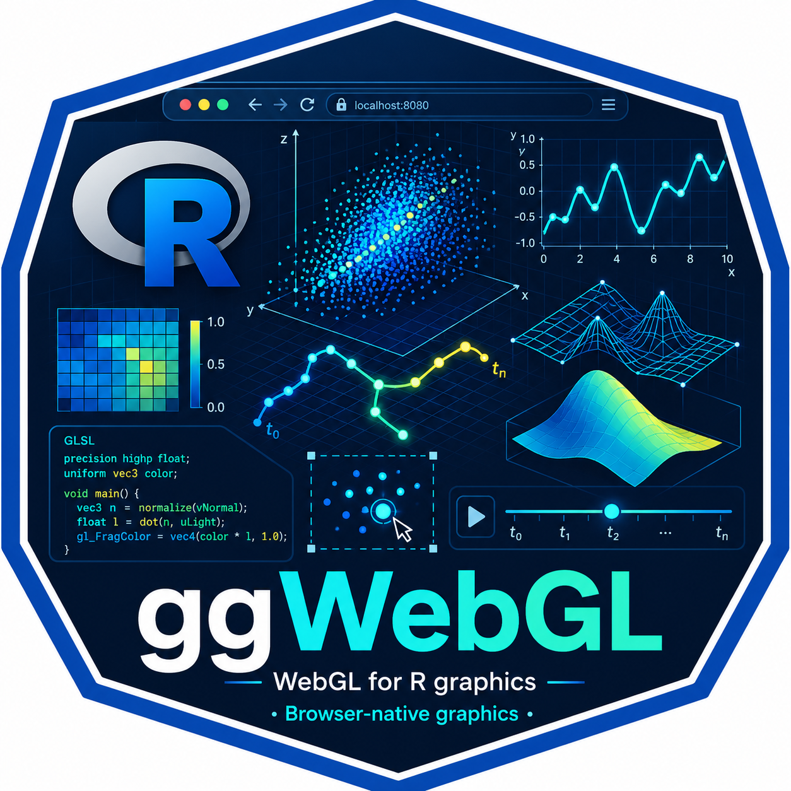

<!-- README.md is generated from README.Rmd. Please edit that file -->

# ggWebGL, Browser-Native ‘WebGL’ Rendering for R Graphics 

## Frédéric Bertrand

`ggWebGL` is an R package for browser-native `WebGL` rendering of R
graphics through `htmlwidgets`. It supports grammar-style graphics
workflows and renderer-ready specifications for dense analytical and
scientific scenes. The stable current scope covers core
widget/specification construction, point, line, raster, fixed-scale
facet, pan/zoom/hover, `Shiny` output, and static export helpers.
Vector, mesh, surface, trajectory, timeline, brush/lasso, transport, and
structured 3D view support are implemented public APIs but remain
experimental unless a future release explicitly promotes them.

The package keeps rendering in the browser and avoids any mandatory
`CUDA`, `Metal`, or `OpenCL` toolchain. Heavier preprocessing,
large-data preparation, and device-specific acceleration are left to
companion packages.

Suggested integrations extend this renderer boundary without becoming
core requirements: `XGeoRTR` can provide explainable-geometry state that
is adapted to renderer-ready primitives, and `boids4R` can provide swarm
simulation frames rendered as animated point/vector timelines. These
packages own their domain semantics; `ggWebGL` owns the browser renderer
and widget behavior.

## Scope

`ggWebGL` provides two complementary interfaces:

- grammar-style layers for selected `ggplot2` workflows;
- renderer-ready layer and specification helpers for downstream packages
  or custom visualization pipelines.

The package provides browser-native rendering, widget construction,
renderer-ready specifications, shader modes, interaction contracts,
optional extension classes, and static export surfaces. It does not
implement downstream scientific, simulation, topological,
model-explanation, or domain-specific semantics. Those semantics should
enter `ggWebGL` through explicit adapter boundaries such as
backend-neutral tables, renderer-ready primitive layers, or
`ggwebgl_spec` payloads.

## Support matrix

Status labels are conservative. `Stable` means the API is part of the
core package path; `Experimental` means it is exported and tested but
still subject to renderer-contract refinement; `Optional extension`
means the feature depends on a suggested downstream package;
`Metadata-only` means the package records information without claiming
full rendering support; `Deferred` means the item is intentionally out
of the current core package.

| Public API | Status | Evidence | Notes |
|----|----|----|----|
| `ggWebGL()`, `ggplot_webgl()`, `ggwebgl_spec()`, `as_ggwebgl_spec()` | Stable | `tests/testthat/test-api-scaffold.R`, `tests/testthat/test-render-schema-v2.R` | Core widget and renderer-specification construction. |
| `theme_webgl()`, `webgl_spec()` | Stable | `tests/testthat/test-api-scaffold.R`, `tests/testthat/test-render-schema-v2.R` | Core renderer option normalization. |
| `geom_point_webgl()`, `geom_line_webgl()`, `geom_raster_webgl()` | Stable | `tests/testthat/test-api-scaffold.R`, `vignettes/getting-started.Rmd` | Focused grammar-style `ggplot2` rendering paths. |
| `ggwebgl_layer_points()`, `ggwebgl_layer_lines()`, `ggwebgl_layer_raster()` | Stable | `tests/testthat/test-adapter-interfaces.R`, `tests/testthat/test-render-schema-v2.R` | Renderer-ready primitive layer helpers. |
| `ggWebGLOutput()`, `renderGgWebGL()` | Stable | `tests/testthat/test-rd-example-coverage.R`, `inst/examples/shiny/basic-app.R` | Shiny output/render bindings. |
| `snapshot_ggwebgl()`, `compose_ggwebgl_figure()` | Stable | `tests/testthat/test-static-export.R`, `tests/testthat/test-publication-rendering.R` | Static export and figure composition helpers; browser capture dependencies are optional. |
| `ggwebgl_example_data()` | Stable | `tests/testthat/test-real-data-and-benchmarks.R`, `vignettes/real-data-evidence.Rmd` | Packaged example data only. |
| `geom_vector_webgl()`, `ggwebgl_layer_vectors()` | Experimental | `tests/testthat/test-future-work-roadmap.R`, `vignettes/renderer-capabilities.Rmd` | 2D/3D vector glyph rendering and renderer-owned ids. |
| `geom_path3d_webgl()` | Experimental | `tests/testthat/test-path3d-webgl.R`, `vignettes/temporal-trajectories.Rmd` | Ordered 3D path serialization; timeline behavior remains experimental. |
| `ggwebgl_timeline()`, `animation_spec()`, `scale_time_webgl()`, `updateGgWebGLTimeline()` | Experimental | `tests/testthat/test-timeline-metadata.R`, `tests/testthat/test-shiny-timeline.R`, `vignettes/temporal-trajectories.Rmd` | Timeline metadata, browser controls, and Shiny timeline messages. |
| `coord_webgl_3d()`, `ggwebgl_view()` | Experimental | `tests/testthat/test-render-schema-v2.R`, `tests/testthat/test-interaction-runtime.R`, `vignettes/renderer-capabilities.Rmd` | 3D view metadata and browser camera controllers. |
| `geom_mesh_webgl()`, `ggwebgl_layer_mesh()`, `as_mesh_webgl()`, `ggwebgl_mesh()` | Experimental | `tests/testthat/test-mesh-webgl.R`, `vignettes/surface-mesh-showcase.Rmd` | Unstructured indexed triangle mesh path; high-scale decimation is not core. |
| `geom_surface_webgl()`, `stat_surface_webgl()`, `ggwebgl_layer_surface()`, `surface_matrix()` | Experimental | `tests/testthat/test-surface-webgl.R`, `vignettes/surface-mesh-showcase.Rmd` | Structured-grid surface path; terrain preprocessing remains external. |
| `ggwebgl_selection()`, `ggwebgl_interactions()` | Experimental | `tests/testthat/test-interaction-spec.R`, `tests/testthat/test-interaction-runtime.R`, `vignettes/renderer-capabilities.Rmd` | Brush/lasso/click/hover metadata and browser interaction contract. |
| `ggwebgl_magnify_region()` | Experimental | `tests/testthat/test-magnify-region.R`, `vignettes/renderer-capabilities.Rmd` | Static and interactive linked zoom metadata. |
| `ggwebgl_material()`, `ggwebgl_publication_figure()` | Experimental | `tests/testthat/test-mesh-webgl.R`, `tests/testthat/test-publication-rendering.R` | Renderer material metadata and publication-oriented composition path. |
| `ggwebgl_transport()` | Experimental | `tests/testthat/test-transport-lod.R`, `tests/testthat/test-performance-500k-smoke.R`, `vignettes/interactive-benchmarks.Rmd` | Compact point transport and LOD metadata; browser metrics are diagnostics, not fixed performance claims. |
| `as_ggwebgl_spec.xgeo_state()`, `XGeoRTR` examples | Optional extension | `tests/testthat/test-xgeo-adapter.R`, `vignettes/xgeortr-bridge.Rmd` | Suggested package integration; `XGeoRTR` owns explainable-geometry semantics. |
| `boids4R` animation examples | Optional extension | `tests/testthat/test-downstream-boids4r-example.R`, `vignettes/boids4r-animation.Rmd` | Suggested package integration; `boids4R` owns swarm simulation semantics. |
| Free-scale facet handling and unsupported layer notes | Metadata-only | `tests/testthat/test-api-scaffold.R` | Metadata is retained without claiming full renderer parity. |
| Native GPU preprocessing, fixed FPS statements, external shader plugin API, high-scale mesh decimation, and domain semantics | Deferred | `inst/specs/user-api-v2.md`, `vignettes/interactive-benchmarks.Rmd` | Out of core unless a future package or benchmark artifact supplies complete evidence. |

`ggWebGL` is not a full replacement for `ggplot2`. It is a
browser-native `WebGL` rendering backend with both grammar-style front
ends and explicit renderer-ready adapter boundaries.

## Installation

``` r
install.packages("ggWebGL")
```

For the development version:

``` r
# install.packages("remotes")
remotes::install_github("fbertran/ggWebGL")
```

## Basic use

``` r
library(ggplot2)
library(ggWebGL)

plot <- ggplot(diamonds, aes(carat, price, colour = cut)) +
  geom_point_webgl(size = 1.1, alpha = 0.18) +
  theme_webgl(
    shader = "density_splat",
    interactions = c("pan", "zoom", "hover")
  )

ggplot_webgl(plot, height = 520)
```

## Renderer-ready specifications

`ggWebGL` can also render explicit primitive layers without requiring
the input to originate from a `ggplot2` object.

``` r
library(ggWebGL)

points <- ggwebgl_layer_points(
  data.frame(
    x = c(0, 1, 2),
    y = c(2, 1, 0),
    colour = c("#0f766e", "#f97316", "#2563eb")
  ),
  x = "x",
  y = "y",
  colour = "colour",
  size = 4
)

spec <- ggwebgl_spec(
  layers = list(points),
  labels = list(title = "Renderer-ready point layer")
)

ggWebGL(spec, height = 420)
```

## Architecture

1.  Parse stable grammar-style point, line, raster, and fixed-scale
    facet layers.
2.  Normalize parsed layers into a renderer-scene contract.
3.  Accept renderer-ready primitive payloads from explicit adapter
    boundaries.
4.  Accept implemented optional extension classes for vectors, meshes,
    surfaces, timelines, selection metadata, and structured views when
    callers opt in.
5.  Resolve raster fills and styling metadata on the R side.
6.  Bind panel-local payloads to browser-side `WebGL` buffers, textures,
    attributes, and shader modes.
7.  Render interactively through an `htmlwidgets` widget.
8.  Reuse the same widget in `Shiny`.

For static capture and publication workflows, `ggWebGL` exposes:

- `snapshot_ggwebgl()` for PNG/JPEG captures;
- `compose_ggwebgl_figure()` for figure assembly, labels, and
  lightweight annotations.
