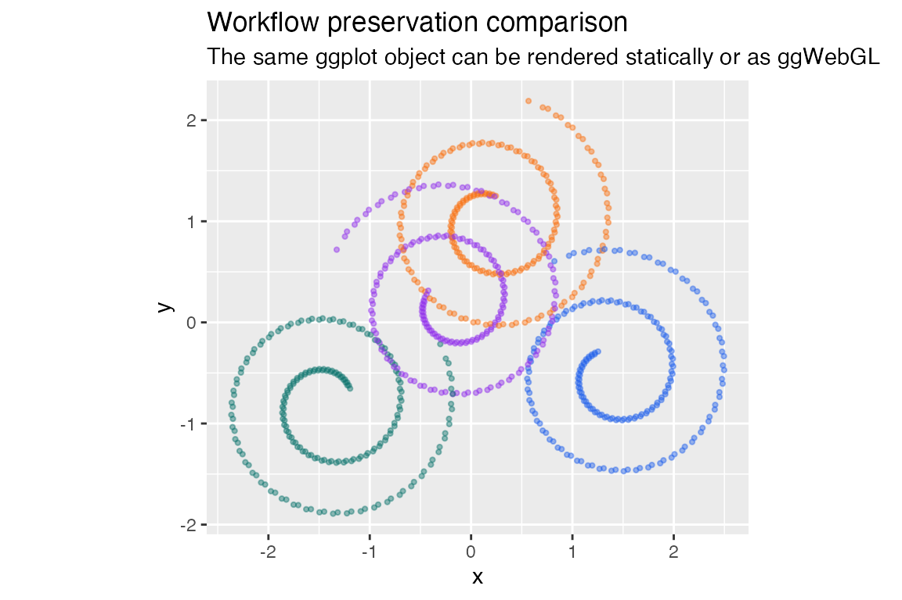

# Interactive benchmark metrics with ggWebGL

## Purpose

`ggWebGL` includes manual benchmark helpers for measuring browser
rendering behavior across representative scene types. These helpers are
diagnostic: rows without browser metadata are not complete browser
measurements, and fixed performance numbers should not be reported from
incomplete rows.

**Status.** Compact transport, progressive upload metadata, and browser
metric helpers are `Experimental` diagnostics. They support local
measurement and smoke testing, not public fixed-FPS claims.

The benchmark scripts are not run automatically by package checks. They
write only to an explicit `output_dir` or
[`tempdir()`](https://rdrr.io/r/base/tempfile.html).

## Metric Schema

The scene benchmark helper records a stable set of columns so local
browser runs can be compared without changing downstream analysis code.

``` r
benchmark_scene_columns()
#>  [1] "scene_id"                   "package_version"           
#>  [3] "commit_sha"                 "dataset_size"              
#>  [5] "primitive_counts"           "transport_mode"            
#>  [7] "serialized_bytes"           "artifact_bytes"            
#>  [9] "startup_latency_ms"         "first_interactive_frame_ms"
#> [11] "selection_latency_ms"       "median_frame_time_ms"      
#> [13] "p95_frame_time_ms"          "median_fps"                
#> [15] "p95_fps"                    "memory_used_mb"            
#> [17] "browser"                    "browser_version"           
#> [19] "gpu_renderer"               "device"                    
#> [21] "os"                         "pixel_width"               
#> [23] "pixel_height"               "interaction"               
#> [25] "artifact_html"              "artifact_csv"              
#> [27] "status"                     "created_at"
```

The most important groups are:

- scene identity and package metadata;
- payload and artifact sizes;
- startup and browser frame timings;
- browser, device, GPU, and pixel-size metadata;
- artifact paths and completion status.

## Manual Dense Embedding Run

The dense embedding helper builds a deterministic million-point scene
using compact point transport, progressive upload metadata, the
`density_splat` shader, and rectangular brush selection.

``` r
source(system.file("examples", "htmlwidget", "million-point-embedding.R", package = "ggWebGL"))
run_manual_million_point_embedding()
```

## Scene-Type Metrics

Use `benchmark_scene_types()` to produce a CSV with one row per scene.
Browser metrics are populated only when a browser capture path is
explicitly requested and available.

``` r
source(system.file("benchmarks", "benchmark-scene-types.R", package = "ggWebGL"))
metrics <- benchmark_scene_types(
  output_dir = tempdir(),
  scenes = c("embedding", "trajectories", "surface_mesh", "workflow"),
  point_count = 1000000L,
  include_browser = FALSE
)
metrics[, c("scene_id", "serialized_bytes", "artifact_bytes", "status")]
```

## Workflow Comparison

A useful smoke check is whether the same data mapping can be inspected
both as a static `ggplot2` graphic and as a browser-native WebGL widget.
The reduced example below uses deterministic in-memory data.

``` r
workflow_comparison_plot(800L)
```



``` r
workflow_comparison_widget(800L, height = 360)
```

## Interpreting Results

Rows with `status = "browser_skipped"` are useful for checking payload
size and widget artifact size only. Browser timing fields should be
interpreted only when the row includes browser, GPU, device, and
pixel-size metadata from the machine that performed the run.
