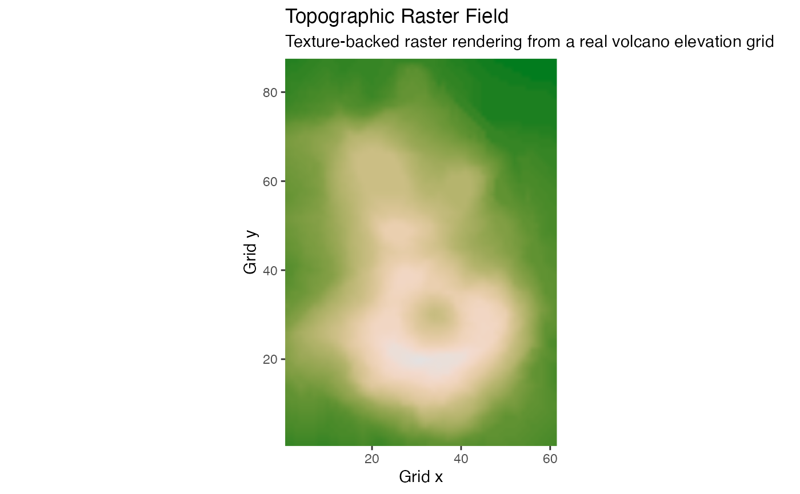
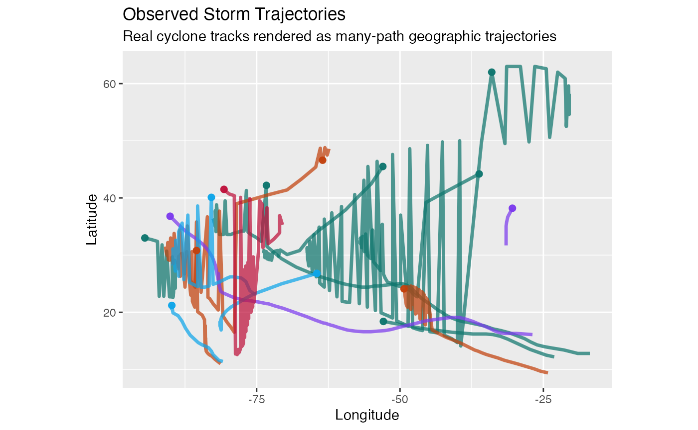
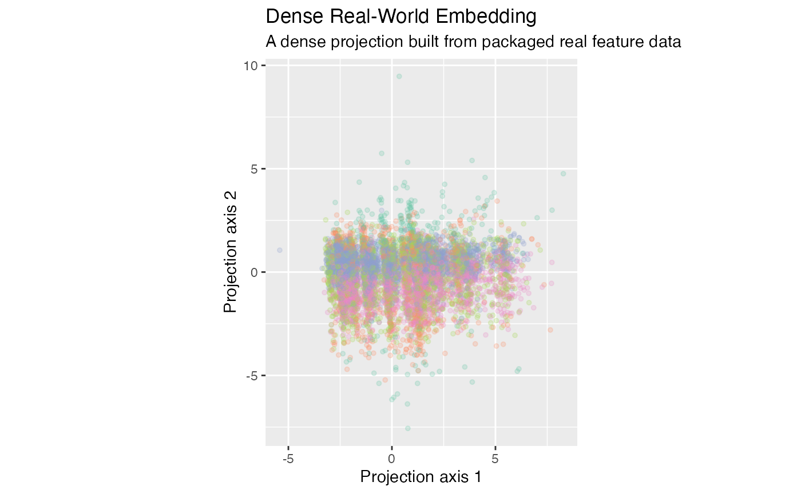
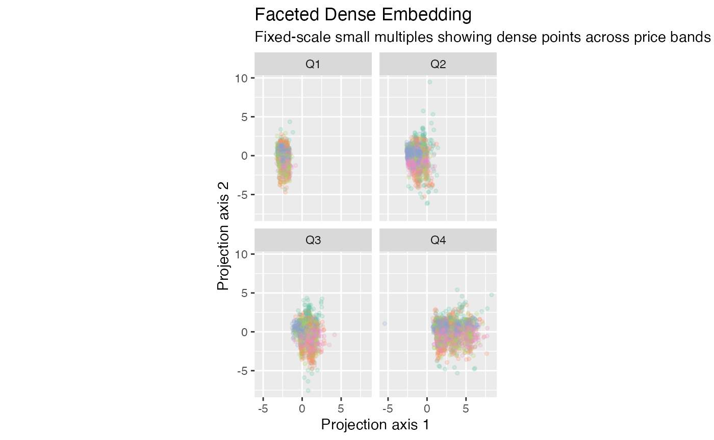

# Real-Data Evidence

## Real-Data Lens

This vignette complements the synthetic showcase with real offline
datasets that exercise the renderer on:

- a raster scalar field
- observed storm trajectories
- a dense 10,000-point projection
- fixed-scale faceted dense point panels

The goal is evidence rather than maximal detail. Every example is built
from packaged data that is available without network access.

Code examples are shown by default. Live WebGL widgets are disabled
during CRAN, package checks, and CI. Rich local or pkgdown rendering
requires `GGWEBGL_EVAL_COVERAGE_VIGNETTE=true` and
`GGWEBGL_EVAL_LIVE_WIDGETS=true`.

For network-enabled environments,
`inst/scripts/download_mnist_embedding.R` provides an optional path to a
larger MNIST-style embedding export. The packaged vignette keeps the
offline dense embedding so the article builds reliably everywhere.

## Example 1: Topographic Raster Field

**Why this example matters.** This is the raster path on a real
elevation grid. It exists to demonstrate that
[`geom_raster_webgl()`](https://fbertran.github.io/ggWebGL/reference/geom_raster_webgl.md)
is now a rendered raster field, not only an exported placeholder.

**What to inspect.** Terrain structure should remain continuous during
pan and zoom, and interpolation should avoid visible block artifacts in
the default example.

``` r
real_examples$volcano_dem
```



``` r
ggplot_webgl(real_examples$volcano_dem+theme_webgl(shader = "default"), height = 620)
```

``` r
ggplot_webgl(real_examples$volcano_dem, height = 620)
```

## Example 2: Observed Storm Trajectories

**Why this example matters.** This is the real trajectory case. It
demonstrates the package on geographic path bundles with real
timestamps, wind speeds, and pressure measurements behind the rendered
lines.

**What to inspect.** Age shading and endpoint emphasis should make
direction and final position legible across multiple storms.

``` r
real_examples$storm_tracks
```



``` r
ggplot_webgl(real_examples$storm_tracks+theme_webgl(shader = "default"), height = 620)
```

``` r
ggplot_webgl(real_examples$storm_tracks, height = 620)
```

## Example 3: Dense Real-World Embedding

**Why this example matters.** This is the dense point-cloud case using a
real 10,000-point feature projection. It tests whether the point
renderer remains legible on a real dense distribution instead of only on
synthetic blobs.

**What to inspect.** Look for high-density accumulation without collapse
into an undifferentiated cloud.

``` r
real_examples$dense_embedding
```



``` r
ggplot_webgl(real_examples$dense_embedding+theme_webgl(shader = "default"), height = 620)
```

``` r
ggplot_webgl(real_examples$dense_embedding, height = 620)
```

## Example 4: Fixed-Scale Faceted Panels

**Why this example matters.** This is the facet-support case. It
exercises the new multi-panel layout on dense real point data.

**What to inspect.** Each panel should clip correctly, preserve its own
interaction state, and remain comparable because scales stay fixed
across panels.

``` r
real_examples$faceted_embedding
```



``` r
ggplot_webgl(real_examples$faceted_embedding+theme_webgl(shader = "default"), height = 720)
```

``` r
ggplot_webgl(real_examples$faceted_embedding, height = 720)
```

## Real-Data Demo

The same real-data scenes are available in a Shiny app:

``` r
source(system.file("examples", "shiny", "real-data-demo.R", package = "ggWebGL"))
```

And as standalone HTML exports:

``` r
source(system.file("examples", "htmlwidget", "real-data-gallery.R", package = "ggWebGL"))
export_real_data_gallery()
```
